# OpenMPT ANSI Syntax Highlighting

## Info

This Java program adds syntax highlighting to your clipboard (using ANSI color codes) when copying pattern data in [OpenMPT](https://openmpt.org).

The main purpose of this program is to paste syntax-highlighted OpenMPT pattern data in [Discord](https://discord.com), using `ansi` markdown code blocks.

## Demo

Discord screenshot, showing a section of an OpenMPT pattern, with and without syntax highlighting.
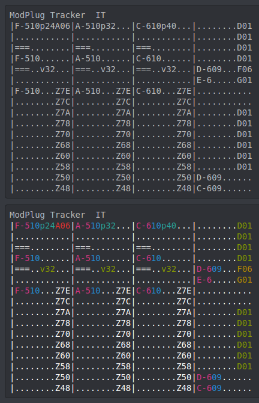

## Command-line usage

`[EXEC] [OPTIONS] [COLORS]`

Options:
* `-h` or `--help`: Help (show all available options)
* `-i`: Read input from STDIN instead of clipboard
* `-o`: Write output to STDOUT instead of clipboard
* `-d`: Automatically wrap output in `ansi` markdown code block (for Discord)
* `-r`: Reverse mode - removes syntax highlighting instead of adding

Using the `-d` option does nothing if the `-r` option is enabled.

Colors:
`X,X,X,X,X,X,X,X` - Each value from 0 to 15 (Discord only supports 0 to 7)\
format: `Default,Note,Instrument,Volume,Panning,Pitch,Global,ChannelSeparator`\
if not provided: `7,5,4,2,6,3,1,7`

## Example color schemes

<table>
    <tr>
        <th rowspan="2">Color scheme</th>
        <th colspan="3">Preview</th>
        <th rowspan="2">Command-line argument</th>
    </tr>
    <tr>
        <th>Console (dark)</th>
        <th>Console (bright)</th>
        <th>Discord (dark)</th>
    </tr>
    <tr>
        <td>Default</td>
        <td>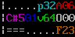</td>
        <td>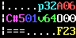</td>
        <td>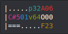</td>
        <td>`7,5,4,2,6,3,1,7`</td>
    </tr>
    <tr>
        <td>OpenMPT</td>
        <td>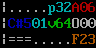</td>
        <td>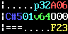</td>
        <td>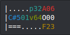</td>
        <td>`7,4,6,2,6,3,1,7`</td>
    </tr>
    <tr>
        <td>Impulse Tracker ("Camouflage")</td>
        <td>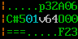</td>
        <td>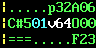</td>
        <td>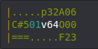</td>
        <td>`2,2,2,6,7,2,2,3`</td>
    </tr>
    <tr>
        <td>FastTracker 2 ("Why Colors?")</td>
        <td>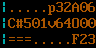</td>
        <td>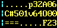</td>
        <td>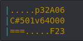</td>
        <td>`3,3,3,3,3,3,3,6`</td>
    </tr>
</table>
